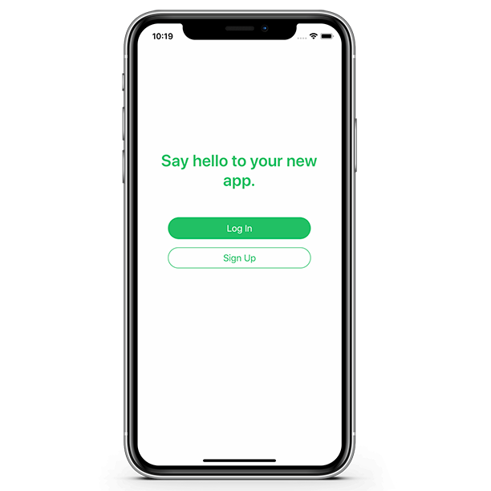

## A mobile application available on IOS and Android.

---

## PMG Rentals App

---

## Login or Signup

---

## Login with Facebook or Email 

---

## Or create a new account

---

## Firebase Authentication

---

## All photos are stored in Firebase Storage

---

## Google Maps and Apple Maps

---

## Interactive map view

---

## “Save for later” functionality

---

## Reviews and Ratings 

---

## Reviews are enabled or disabled by admin 

---

## Ratings are automatically calculated

---

## Custom filters - add as many as you want

---

## Display filtered results in both list and map 

---

## Each property listing can contain unlimited photos

---

## Location picker helps you select exact location

---

## Categories Screen

---

## Listings Screen

---

## Single Listing Screen

---

## Easy to use Tab Bar Navigation